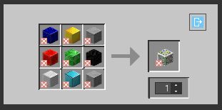
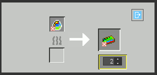
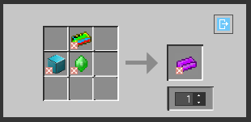
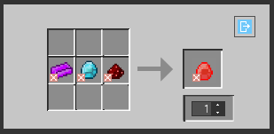
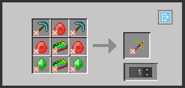
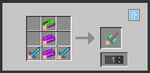

# Ultimate Destruction Mod (Beta 1.0) 🚀

Bem-vindo ao repositório do Ultimate Destruction Mod para o Minecraft 1.12.2! Este mod traz várias funcionalidades emocionantes para o seu mundo de blocos favorito. 
Observe que ainda está em desenvolvimento e o mod pode não funcionar da maneira correta.

## Funcionalidades Principais ✨

- ✅ Adiciona novos biomas deslumbrantes.
- ⚔️ Introduz novos monstros desafiadores.
- 🧪 Novos itens mágicos para tornar a jogabilidade mais interessante.
- 🏰 Construa estruturas épicas com novos blocos.

## Como Instalar 📥

1. Baixe a versão mais recente do mod [aqui](https://github.com/solitariewolf/Ultimate-Destruction-Mod/blob/main/ultimate_destruction_mod.jar).
2. Coloque o arquivo .jar na pasta de mods do seu cliente Minecraft.
3. Inicie o jogo e aproveite as novas funcionalidades!

## Contribuições e Problemas 🐞

- Se você quiser contribuir com este projeto, sinta-se à vontade para fazer um fork e enviar um pull request.
- Se encontrar algum problema, por favor, relate-o [aqui](link_para_issues).

## Licença 📜

Este mod é distribuído sob a licença MIT. Veja o arquivo [LICENSE](LICENSE) para mais detalhes.

## Receitas 📜

=========================

- Receita do Minério
Caso o mundo já esteja gerado você pode craftar o minério seguindo a receita abaixo.

=========================

- Receita do Ultimate Ingot
O ultimate ingot é um dos principais itens do mod para craftar as poderosas ferramentas.

=========================

- Receita do Poudretteite Ingot
O Poudretteite Ingot é uma barra de minério que existe no mundo real e agora também no minecraft, também utilizado para craftar as ferramentas do mod.

=========================

- Receita do Diamante Vermelho
  

=========================

- Receita da Picareta Ultimate
Uma picareta capaz de destruir blocos em 3x3 a uma velocidade e durabilidade incrível

=========================

- Receita da Espada Ultimate
Uma poderosa espada hit kill capaz de mantar rápidamente qualquer MOB.

# Ultimate Destruction Mod (Beta 1.0) 🚀

Welcome to the repository of the Ultimate Destruction Mod for Minecraft 1.12.2! This mod brings several exciting features to your favorite blocky world.
Please note that it's still in development, and the mod may not function correctly.

## Key Features ✨

- ✅ Adds stunning new biomes.
- ⚔️ Introduces challenging new monsters.
- 🧪 New magical items to make gameplay more interesting.
- 🏰 Build epic structures with new blocks.

## How to Install 📥

1. Download the latest version of the mod [here](https://github.com/solitariewolf/Ultimate-Destruction-Mod/blob/main/ultimate_destruction_mod.jar).
2. Place the .jar file in your Minecraft client's mods folder.
3. Start the game and enjoy the new features!

## Contributions and Issues 🐞

- If you'd like to contribute to this project, feel free to fork it and send a pull request.
- If you encounter any issues, please report them [here](link_to_issues).

## License 📜

This mod is distributed under the MIT license. See the [LICENSE](LICENSE) file for more details.

## Recipes 📜

=========================

- Ore Recipe
If your world is already generated, you can craft the ore using the recipe below.

=========================

- Ultimate Ingot Recipe
The ultimate ingot is one of the main items in the mod for crafting powerful tools.

=========================

- Poudretteite Ingot Recipe
The Poudretteite Ingot is an ore bar that exists in the real world and now in Minecraft, also used for crafting mod tools.

=========================

- Red Diamond Recipe

=========================

- Ultimate Pickaxe Recipe
A pickaxe capable of breaking blocks in a 3x3 pattern at incredible speed and durability.

=========================

- Ultimate Sword Recipe
A powerful one-hit kill sword capable of quickly dispatching any MOB.

